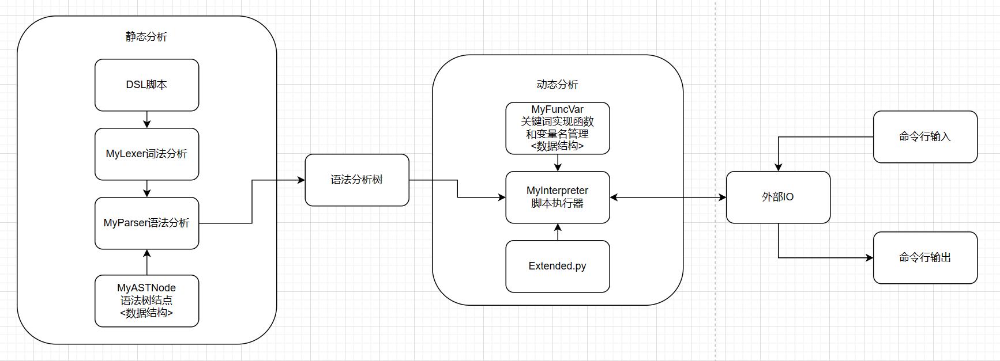

# ROBOTDSL开发文档

---
## 风格
### 代码注释

- python文件的注释在import之后
- class类的注释在类中第一行
- def函数的注释在函数中第一行
- 示例如下：
```python
#test.py
from lib.ConfigYamlLoader import MyConfigLoader
from lib.Lexer import MyLexer
from lib.Parser import MyParser
from lib.Interpreter import MyInterpreter
from lib.FuncVar import MyFuncVar
import yaml
import sys

'''
自动化测试脚本
其中一部分内容为可行性测试
一部分为正确性测试
测试过程均会有输出，但是只有正确性测试会有异常抛出
最后一个测试可以通过修改manual变量，改为手动测试
'''
class MyConfigLoaderTest:
    '''
    MyConfigLoader类的测试桩
    '''
    def test_parseScript(self):
        '''
        测试简单DSL脚本能否进行静态分析
        可行性检测
        正确性检测需要在执行时测试
        '''
        conf=MyConfigLoader()
        conf.load('./data/default.yaml')
        lexer=MyLexer(conf)
        lexer.loadScript('./testdata/example.dsl')
        parser=MyParser(conf, lexer)
        with open('testdata/example.dsl', 'r', encoding='utf-8') as file :
            tree = parser.parseScript(file.read())
            tree.printTree()
    
```
### 命名风格

- 类名统一使用大驼峰命名格式，手写的都要以My...开头，如MyLexer,MyParser
- 类中public方法和变量，使用小驼峰命名格式，如getVar(),assign()
- 类中private方法和变量，使用_<小驼峰>的命名格式，如_callfunc(),_execute()

## 设计和实现

### 模块划分
- 主要模块和功能如下
  - MyConfigLoader实现配置文件的读入和分析
  - MyLexer实现对DSL的词法分析
  - MyParser实现对DSL的语法分析，输出语法分析树
  - MyASTNode提供语法分析树单个结点的数据结构，可递归输出子树结构
  - MyInterpreter实现DSL的单步语句执行和函数递归调用管理
  - MyFuncVar提供了基本关键词的函数实现和全局变量的管理
- MyLexer、MyParser、MyASTNode实现对DSL脚本的静态分析
- MyInterpreter、MyFuncVar实现对DSL的动态分析和执行
- 对于还调用了外部扩展函数的脚本，Extended.py中的“扩展函数”也参与了动态分析
- 关系图如下


### 数据结构

#### 语法分析树

- 每个语法分析树结点包含两个部分，第一部分储存该节点的类型和其他必要信息，第二部分存储直接子结点。
- 通过语法树表达代码之间的嵌套关系，子结点为父结点的代码块的一部分，兄弟结点之间平级可以执行。
- 对于example2.dsl的main函数部分语法分析树如下
```dsl
Root
-['stepblock', 'main']
--('statement', 'stepto')
---('id', 'phonenumberadd')
--('statement', 'speak')
---['expression']
----['str', '你好，请用标准普通话表达您的需求：1.查询电话号码 2.查询机器人工号 3.查询今日天气 4.退出']
--('statement', 'listen')
---['expression']
----['str', '30']
--['statement', 'switch', 'inputBuffer']
---['case', '查询电话号码']
----('statement', 'stepto')
-----('id', 'phonenumberquery')
---['case', '查询机器人工号']
----('statement', 'speak')
-----['expression']
------['str', '为您服务的机器人工号是']
------['var', '_robotID']
---['case', '退出']
----('statement', 'exit')
---['case', 'exit']
----('statement', 'exit')
---['case', '查询今日天气']
----('statement', 'stepto')
-----('id', 'weather')
---['case', 'weather']
----('statement', 'stepto')
-----('id', 'weather')
---['case', '']
----('statement', 'speak')
-----['expression']
------['str', '输入超时']
---['default']
----('statement', 'speak')
-----['expression']
------['str', '很抱歉暂无此功能']
```
#### 符号表
- MyFuncVar内通过Hash表实现全局变量的符号表 
- listen输入存入$inputBuffer中
- call扩展函数的返回值存入$ret中

#### 脚本递归调用栈
不需要特别实现，MyInterpreter中调用分析语法树的系统栈即可辅助完成脚本的递归调用

### 功能
- 根据用户书写DSL脚本执行，得到预期效果，目前支持如下关键词：
  - step-endstep 用于指示定义函数的作用范围，脚本中必须包含step main
  - stepto 函数中调用已定义函数的命令，无参数，无返回值
  - switch case default end switch 通过变量实现分支语句
  - speak 将目标内容输出到命令行，可重写为语音输出
  - listen STR 支持在有限制时间的输入，可重写为语音输入
  - exit 强制结束脚本
  - call 调用扩展函数，可带任意参数，返回值在$ret
- 用户如果想要调用额外的函数可以在extended.Extended.py（或者自定义路径的库中）重写新的函数，要求输入和输出均为字符串
- 详细的脚本实现规范见**记法**章节中

### 文档
见当前文档

## 接口

### 程序间接口

#### 静态分析部分
- MyLexer构造整个可用的DSL词法分析器，通过类传给MyParser
- MyASTNode提供*语法树的结点*结构和查看子树结构的函数，通过类传给MyParser
- MyParser接收MyLexer和MyASTNode，将分析后得到的语法分析树传给Interpreter

#### 动态分析部分
- MyFuncVar提供关键词的函数实现以及变量的赋值访问功能，通过类传给Interpreter
- MyInterpreter接收MyParser的分析树和MyFuncVar类，完成运行部分控制
- Extended.py提供了额外调用扩展函数，MyInterpreter通过_callFunction调用

#### 扩展函数
- 扩展函数写入./extended/Extended.py或者配置的对应文件中
- 要求函数的输入参数为字符串，返回值也为字符串

### 人机接口

#### 面向脚本编写者
- 通过修改config.yaml配置执行文件路径，和运行时日志输出
- 通过编写./script/xxx.dsl实现新的功能逻辑
- 通过编写./extended/Extended.py实现额外的扩展函数
- 编写规范见记号章

#### 面向脚本使用者
- 机器人通过speak，提示用户下一步的操作
- 机器人通过listen，接收用户的下一步命令
- 根据脚本执行逻辑，机器人通过speak给用户合理的显示
- 后期通过重写MyFuncVar中的speak和listen方法，可以实现语音输入和输出

## 测试
### 测试桩
- python中通过对需要测试的类，写测试类实现，单个函数对应单个测试，最后通过testList()函数完成统一调用
- 对于MyInterpreter，其测试类MyInterpreterTest的实现如下：
```python
class MyInterpreterTest:
    '''
    MyInterpreter类的测试桩
    '''

    def testGoodDSL(self):
        '''
        简单的DSL脚本
        自动测试
        '''
        config=MyConfigLoader()
        config.load('./testdata/default.yaml')
        funcVar=MyFuncVar('test1',config)
        interpreter=MyInterpreter(config)
        interpreter.reset(funcVar)
        interpreter.run()

    def testStrongDSL(self,manual=False):
        '''
        DSL强测试
        默认自动输入
        可手动调试
        '''
        config=MyConfigLoader()
        config.load('./testdata/strongTest.yaml')
        funcVar=MyFuncVar('test2',config,timeout=manual)
        interpreter=MyInterpreter(config)
        interpreter.reset(funcVar)
        # while interpreter.getStatus():
        if not manual:
            print('auto mode')
            sys.stdin=open('./testdata/in.txt','r',encoding='utf-8')
            sys.stdout=open('./testdata/tempout.txt','w',encoding='utf-8')
            interpreter.run()
            sys.stdout=sys.__stdout__
            with open('./testdata/tempout.txt','r',encoding='utf-8') as file:
                tempout=file.read()
            with open('./testdata/out.txt','r',encoding='utf-8')as file:
                answer=file.read()
            if tempout==answer:
                pass
            else:
                print(tempout)
                print(answer)
                raise RuntimeError('Test failed in MyInterpreter...')
        else:
            print('manual mode')
            interpreter.run()

    def testList(self,manual=False):
        self.testGoodDSL()
        print('-----------')
        self.testStrongDSL(manual)
```
### 自动测试脚本
- 测试分为可行性测试和正确性测试
- 可行性测试：
  - 对于词法分析、语法分析内容，难以直接判断其输出是否正确，但是其正确性可以在后期执行时完成判断
  - 故优先测试词法、语法分析能否正常执行。如果抛出异常，则根据异常抛出处进行修改
- 正确性测试：
  - 对于MyConfigLoader和MyFuncVar的测试，输出结果是可以预料的，需要比较测试结果和预期结果是否一致
  - 对于不一致的输出，抛出异常，方便查错
- 无论可行性还是正确性测试，都要求在故障时输出重要的测试内容，方便后期检查
- 对于DSL的脚本，由于其可交互性，可以编写自动化测试样例。必要时，也可以转为手动测试，更加全面细致。

## 记法
### config.yaml配置要求
一个默认的配置格式如下
```yaml
# default.yaml
runtime:
  log_level: "info"

script:
  path: "./script/example.dsl"
  halt_on_error: true

extended:
  halt_on_error: false
  dirs:
    - "extended.Extended"
```
检测用的schema如下
```python
schema = {
        'runtime': {
            'type': 'dict',
            'schema': {
                'log_level': {'type': 'string', 'allowed': ['info', 'debug', 'error']}
            }
        },
        'script': {
            'type': 'dict',
            'schema': {
                'path': {'type': 'string'},
                'halt_on_error': {'type': 'boolean'}
            }
        },
        'extended': {
            'type': 'dict',
            'schema': {
                'halt_on_error': {'type': 'boolean'},
                'dirs': {'type': 'list', 'schema': {'type': 'string'}}
            }
        }
    }
```
- runtime
  - log_level 指示解释器的日志报告类型仅为可info,debug,error，类型为字符串
- script
  - path DSL脚本所在位置，类型为字符串
  - halt_on_error 静态分析时抛出异常，是否停止，类型为布尔型
- extended
  - halt_on_error 调用扩展函数时若抛出异常，是否停止，类型为布尔型
  - dirs 调用扩展函数的库的位置 要求写成python调用库的形式，类型为字符串

### DSL脚本记法

#### BNF语法格式
- 程序分析过程中DSL采用BNF表示
- 关键词有
```
   step endstep stepto
   switch case default endswitch 
   speak listen exit
   call(py脚本调用) 
```
silence条件可以通过case '' action 的格式实现
- 分析用tokens有
```
VAR STR ID NEWLINES
```
- 可接收的运算符
```
+ =
```
- 被忽视的符号有
```
<空格> \t
```
- 上下文无关语法

```
script  : stepblock
        |stepblock script

stepblock   : 'step' stepname statements 'endstep'

statements  : ε
            | statement statements 

statement   : action
            | switch_case

action  : VAR '=' expression
        | 'speak' expression
        | 'listen' expr
        | 'stepto' ID
        | 'exit'
        | 'call' ID args

switch_case : 'switch' VAR cases 'endswitch'

cases   : case
        | case cases
        | default

case    : 'case' STR action

default : 'default' action

expression  : expr 
            | expr + expression

expr    : VAR | STR

args  : ε
        | expr ' ' args
```

#### 编写规范具体要求
- 脚本中必须含有step main
- 函数定义需要遵循以下格式
```
step xxx
  <statement>
  ...
  <statement>
endstep
```
- 分支语句需要遵循以下格式
```
switch <VAR>
case <expression> <action>
case <expression> <action>
...
default <action>
endswitch
```
- 以下语句需写在完整一行，表示一个动作
```
<VAR> = <expression>
speak <expression>
listen <expr>
stepto ID
exit
call <ID> <args>
```
依次为赋值语句、“语音”输出、限时“语音”输入、函数调用、退出服务、调用扩展函数
- 当使用 ```case <expression> action```语句时，建议使用```stepto ID```替代多个语句
- `listen`命令得到输入在`$inputBuffer`中
- `call`命令得到的返回值在`$ret`中
- `$xxx`表示变量名，`xxx`表示函数名
- 参数和变量的值只有字符串没有数字。
- 但是call中支持`add,minus,multiply,div`函数实现整数加减乘除

### 扩展函数编写规范
参数必须为字符串
不允许有输出
可以有返回值，返回值也必须为字符串，返回值存入`$ret`中